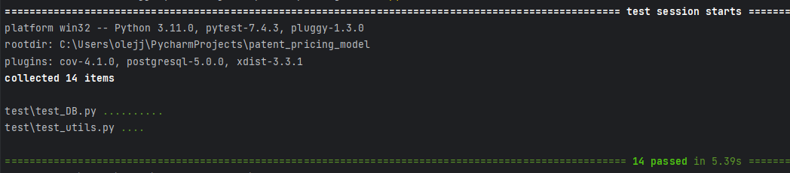
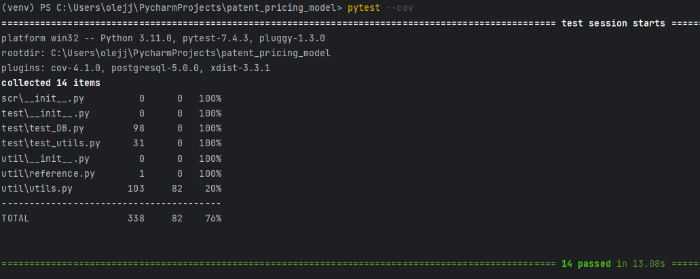
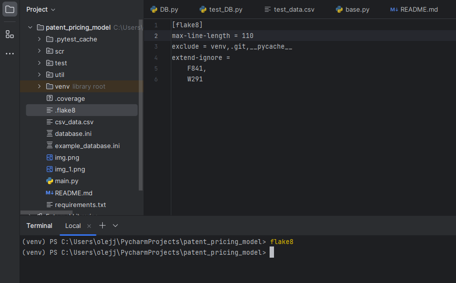

<H1>Дипломная работа: "Модель ценообразования"</H1>
<H3>Задача: создать алгоритм, который будет прогнозировать ценообразование на определенном рынке.</H3>
<H3>Входные данные:</H3>
Файл 'csv_data.csv', в котором может быть какое-угодно количество строк. В данном случае 1 000 000 строк.
В проекте этот файл заархивирован, поэтому нужно будет разархивировать его в этой же папке.
<H3>Стэк используемых технологий:</H3>

 - python 3.11
  
 - postgresql
<H3>Варианты моделей прогнозирования:</H3>

 - Линейная регрессия(LinearRegression)
 
 - Метод случайного леса(RandomForest) 
 
 - Метод подсчета средней цены
<H3>Начало работы:</H3>
 - Установка виртуального окружения и настройка: '''python -m venv venv'''
 - Установка зависимостей: ```pip install -r requirements.txt```
 - В корне проекта создать файл `database.ini` с параметрами для подключения к БД. Если файла не будет, 
то программа будет подключаться по дефолту к БД 'postgres'. В корне проекта есть пример файла .ini
<H3>Запуск:</H3>
 - Для начала работы необходимо запустить файл `main.py`
 - Далее идет работа с пользователем и командами, которые его интересуют.
<H3>Тесты:</H3>
 - Запустить тесты можно с помощью ```pytest```

  
<H3>Coverage:</H3>
✅ Код покрыт тестами минимум на 75%
- 
<H3>Flake8:</H3>
✅ Код оформлен согласно pep8

